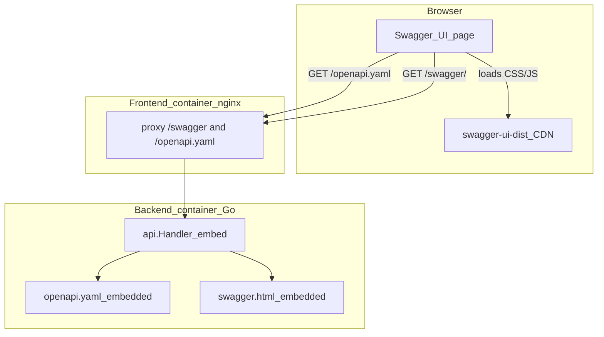
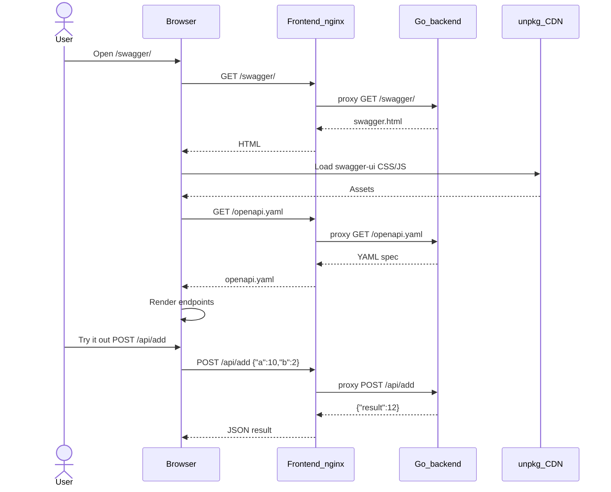

# Swagger / OpenAPI

Newbie guide to how API docs work in this template.

## What is this?

- **OpenAPI** is a machine-readable description of the HTTP API (paths, bodies, responses).
- **Swagger UI** is a web page that reads that description and lets you try endpoints in the browser.

We keep a hand-written OpenAPI 3 file and serve Swagger UI from the Go backend. No code-generation step is required.

## What is implemented

| Piece | Role |
|-------|------|
| [`openapi.yaml`](openapi.yaml) | Contract: `/health`, calculator `POST`s, and `GET /api/history` |
| [`swagger.html`](swagger.html) | HTML page that loads Swagger UI from a CDN and points it at `/openapi.yaml` |
| [`docs.go`](docs.go) | Embeds those files into the binary (`//go:embed`) and serves them over HTTP |
| Frontend `nginx.conf` | Proxies `/swagger/` and `/openapi.yaml` to the backend so one host can reach docs |

Routes:

| Method | Path | Purpose |
|--------|------|---------|
| `GET` | `/openapi.yaml` | Raw OpenAPI spec |
| `GET` | `/swagger/` | Interactive Swagger UI |
| `GET` | `/swagger` | Redirects to `/swagger/` |

## Layers



- The **HTML** comes from our backend (embedded file).
- The **Swagger UI library** is loaded from `unpkg` (needs internet in the browser).
- The **spec** always comes from our backend, so “Try it out” hits the same API host.

## Sequence: open Swagger and call Add



## How to use it

With Compose running:

- Direct backend: `http://localhost:8081/swagger/`
- Via frontend proxy: `http://localhost:8085/swagger/` (or your mapped host port / LAN IP)

1. Open Swagger UI.
2. Expand an operation (e.g. `POST /api/add`).
3. Click **Try it out**, edit `a` / `b`, click **Execute**.
4. Check the response body and status code.

Raw spec:

```bash
curl -s http://localhost:8081/openapi.yaml | head
```

## How to change the docs

1. Edit [`openapi.yaml`](openapi.yaml) (paths, schemas, examples).
2. Rebuild / restart the backend (`docker compose up --build`).
3. Hard-refresh the browser on `/swagger/`.

Keep the YAML in sync with real handlers in `cmd/server/main.go`. Swagger does not generate Go code in this template; it only documents what you already implement.

## Mental model

```
openapi.yaml  =  the map of the API
swagger.html  =  the interactive map viewer
docs.go       =  ships the map + viewer inside the Go binary
```
