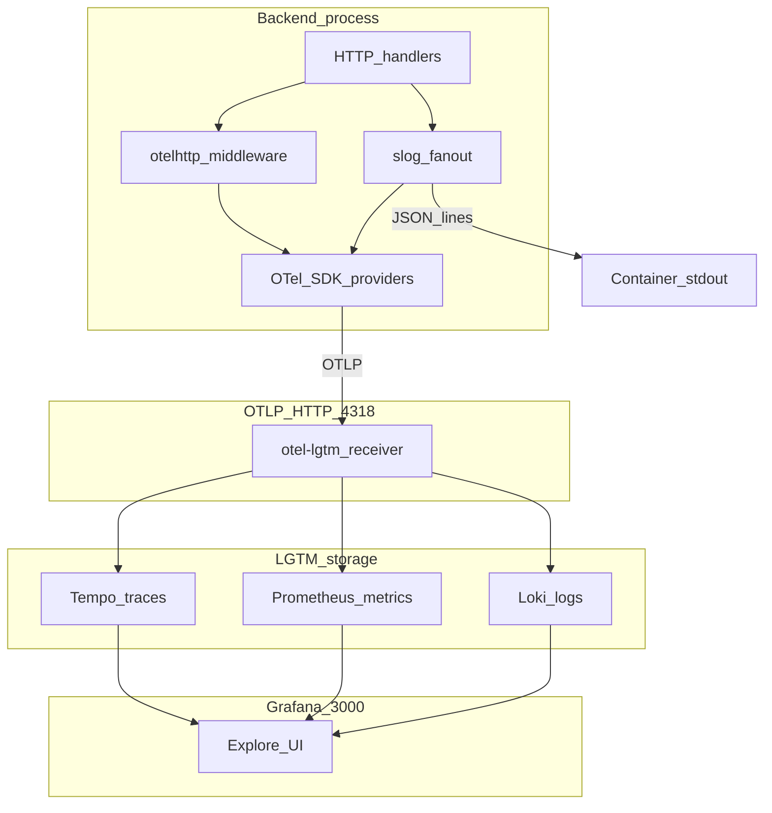
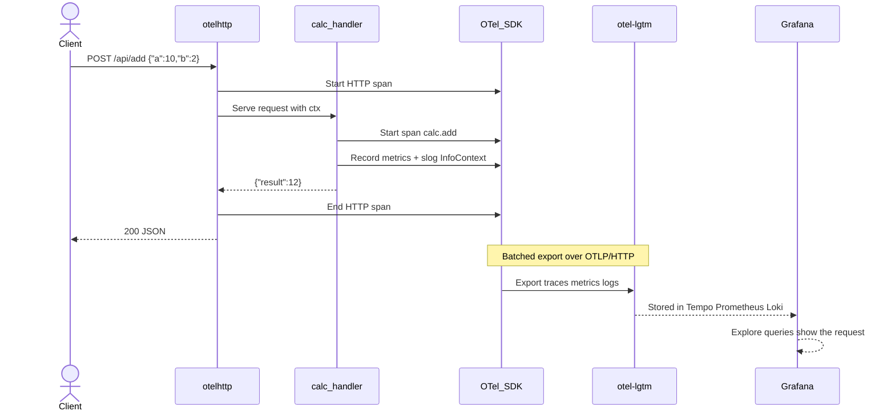
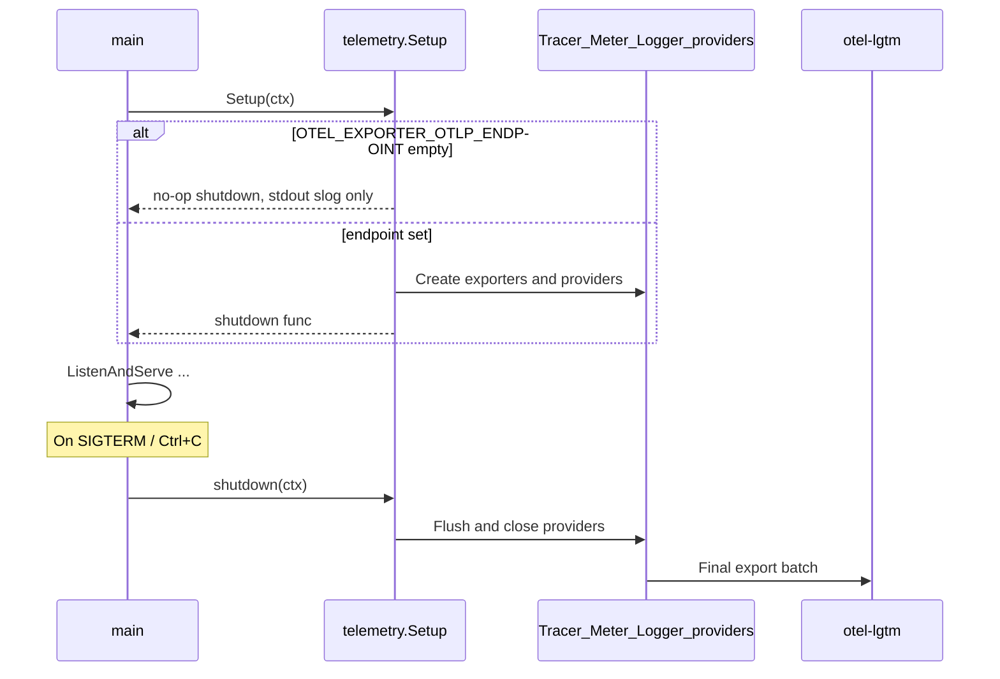

# Telemetry (OpenTelemetry)

Newbie guide to how observability works in this template.

## What is observability?

When the API runs, we want answers to:

| Question | Signal |
|----------|--------|
| What happened on one request? | **Trace** (a timeline of spans) |
| How often / how slow overall? | **Metrics** (counters, histograms) |
| What did the app print? | **Logs** (structured messages) |

**OpenTelemetry (OTel)** is a standard way to create those signals in code and **export** them to a backend. Here the backend is **Grafana LGTM** (Tempo + Prometheus + Loki + Grafana UI).

## What is implemented

| Piece | Role |
|-------|------|
| [`telemetry.go`](telemetry.go) | Starts OTLP exporters for traces, metrics, and logs; returns a `shutdown` function |
| [`fanout.go`](fanout.go) | Sends each log line to **stdout** and to OTel at the same time |
| [`cmd/server/main.go`](../../cmd/server/main.go) | HTTP middleware (`otelhttp`), calc spans, custom metrics, `slog` with request context |
| Compose service `otel-lgtm` | Receives OTLP and shows data in Grafana |

Signals in detail:

| Signal | Implementation |
|--------|----------------|
| Traces | `otelhttp` wraps every HTTP request (except `/health`); each calc op adds a child span `calc.add` / `calc.subtract` / … with attributes `calc.a`, `calc.b`, `calc.result` |
| Metrics | `calculator.operations` (counter) and `calculator.operation.duration` (histogram), labeled by `operation` and `status` |
| Logs | JSON to container stdout + OTLP logs via `otelslog`, including trace context when you use `slog.InfoContext(ctx, …)` |

If `OTEL_EXPORTER_OTLP_ENDPOINT` is **unset**, exporters are skipped and only stdout JSON logs remain (useful for local `go run`).

## Layers



## Sequence: one Add request (happy path)



## Sequence: startup and shutdown



The `shutdown` value returned by `Setup` is a **function** (closure) that still knows about the providers created at startup, so `main` can flush telemetry cleanly on exit.

## Env vars (Compose)

Set on the `backend` service in [`docker-compose.yml`](../../../../docker-compose.yml):

| Variable | Example | Meaning |
|----------|---------|---------|
| `OTEL_SERVICE_NAME` | `calculator-backend` | Name shown in Grafana / Tempo |
| `OTEL_EXPORTER_OTLP_ENDPOINT` | `http://otel-lgtm:4318` | Where to send OTLP/HTTP |
| `OTEL_EXPORTER_OTLP_PROTOCOL` | `http/protobuf` | Prefer HTTP over gRPC for this setup |

## Where to look in Grafana

Open `http://localhost:3000` (or `http://<server-lan-ip>:3000`).

Do **not** expect data under **Dashboards → Starred** (empty by default). Use **Explore**:

1. Generate traffic (calculator UI or `curl` to `/api/add`).
2. **Explore → Tempo** — search service `calculator-backend`, open a trace, expand `calc.add`.
3. **Explore → Prometheus** — query e.g. `calculator_operations_total` or metrics matching `calculator_`.
4. **Explore → Loki** — query e.g. `{service_name="calculator-backend"}` (label names can vary slightly by LGTM version; browse label browser if needed).
5. Set the time range to **Last 15 minutes**.

`/health` is filtered out of HTTP tracing so probes do not spam Tempo.

## Local run without full Compose

```bash
# terminal 1: only the LGTM stack (or full compose)
docker compose up otel-lgtm

# terminal 2
cd apps/backend
export OTEL_SERVICE_NAME=calculator-backend
export OTEL_EXPORTER_OTLP_ENDPOINT=http://localhost:4318
go run ./cmd/server
```

## Mental model

```
Your code creates signals  →  OTel SDK batches them  →  OTLP to LGTM  →  Grafana Explore
```

Traces = one request’s story. Metrics = aggregates. Logs = messages (ideally with the same trace id).
