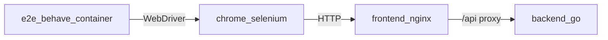

# End-to-end tests (Behave + Selenium)

Browser UI tests that click through the calculator against the real Docker stack.

## What is this?

| Piece | Role |
|-------|------|
| **Behave** | BDD runner (Gherkin `.feature` files → Python steps) |
| **Selenium** | Drives a real Chromium browser |
| **Page object** | [`apps/e2e/pages/calculator_page.py`](../apps/e2e/pages/calculator_page.py) — locators for the UI |

Unlike unit tests (`./scripts/test.sh`), e2e needs the **running app** (frontend + backend) plus a browser container.



## Prerequisites

Only Docker. No local Python, Chrome, or Behave install.

## Run

From the repo root:

```bash
./scripts/e2e.sh
```

That will:

1. Start `backend`, `frontend`, `otel-lgtm`, and `chrome` (Selenium)
2. Build and run the `e2e` container with Behave
3. Exit non-zero if any scenario fails

Pass-through args go to Behave:

```bash
./scripts/e2e.sh --tags @wip
./scripts/e2e.sh features/calculator.feature
```

Equivalent manual Compose:

```bash
docker compose -f docker-compose.yml -f docker-compose.e2e.yml \
  up -d --build backend frontend otel-lgtm chrome

docker compose -f docker-compose.yml -f docker-compose.e2e.yml \
  run --rm --build e2e
```

## Scenarios covered

See [`apps/e2e/features/calculator.feature`](../apps/e2e/features/calculator.feature):

- Add / subtract / multiply / divide happy paths
- Divide-by-zero shows an error and clears the result

## Layout

```
apps/e2e/
  Dockerfile
  requirements.txt
  behave.ini
  entrypoint.sh          # waits for frontend + Selenium, then behave
  features/
    calculator.feature
    environment.py       # WebDriver lifecycle
    steps/
      calculator_steps.py
  pages/
    calculator_page.py
docker-compose.e2e.yml   # chrome + e2e services
scripts/e2e.sh
```

## Environment variables

| Variable | Default in Compose | Meaning |
|----------|--------------------|---------|
| `BASE_URL` | `http://frontend` | Calculator UI origin (Docker DNS name) |
| `SELENIUM_REMOTE_URL` | `http://chrome:4444/wd/hub` | Remote WebDriver endpoint |

## Tips

- Keep e2e scenarios few and stable; put edge-case math in Go/JS unit tests.
- If a run flakes on startup, re-run `./scripts/e2e.sh` — the entrypoint already waits for HTTP readiness.
- To inspect the browser interactively, you can temporarily remove `--headless=new` in `environment.py` and publish Selenium’s noVNC port (advanced).
