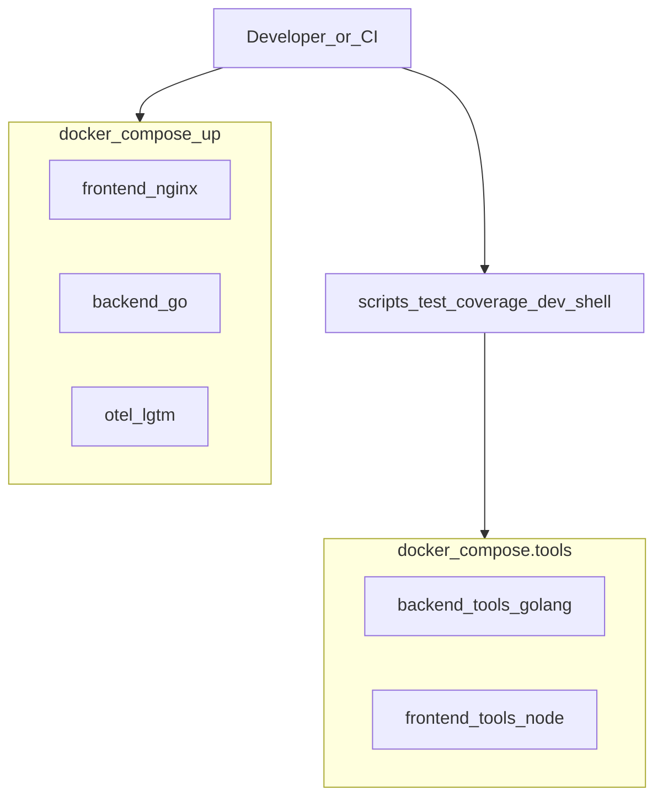

# Testing & coverage

Newbie guide: how tests and coverage work in this monorepo.

## Why tool containers?

You should **not** need to install Go or Node on your laptop. This repo provides **tool containers** (separate from the runtime app containers) with those toolchains baked in.

| Compose file | Purpose |
|--------------|---------|
| [`docker-compose.yml`](../docker-compose.yml) | Run the app (`frontend`, `backend`, `otel-lgtm`) |
| [`docker-compose.tools.yml`](../docker-compose.tools.yml) | Dev/test toolchains (`backend-tools`, `frontend-tools`) |



**Prerequisite on the host:** Docker + Docker Compose only.

## Quick start (recommended)

From the repo root:

```bash
./scripts/test.sh              # unit tests in tool containers
./scripts/coverage.sh          # HTML reports under coverage/
./scripts/dev-shell.sh backend # interactive Go shell
./scripts/dev-shell.sh frontend
```

Defaults use Docker tool containers. Host Go/Node is optional:

```bash
./scripts/test.sh --host
./scripts/coverage.sh --host
```

## Tool services

Defined in `docker-compose.tools.yml`:

| Service | Image | Mount | Caches |
|---------|-------|-------|--------|
| `backend-tools` | `golang:1.25-alpine` | `apps/backend` → `/src` | Go module + build caches (volumes) |
| `frontend-tools` | `node:20-alpine` | `apps/frontend` → `/src` | `node_modules` named volume |

They are **not** started by `docker compose up`. They run on demand via `docker compose … run --rm`.

Manual examples:

```bash
docker compose -p webapp-monorepo-tools -f docker-compose.tools.yml run --rm backend-tools go test ./...

docker compose -p webapp-monorepo-tools -f docker-compose.tools.yml run --rm frontend-tools sh -c 'npm ci && npm test'
```

## Coverage reports

```bash
./scripts/coverage.sh
```

| File | Contents |
|------|----------|
| `coverage/backend.html` | Go HTML report |
| `coverage/backend-func.txt` | Per-function % |
| `coverage/frontend/index.html` | JS HTML report (`calculator.js`) |

Open the HTML files in a browser on your host (they are written to a bind-mounted folder).

## What is covered

| Area | Tests live in | Notes |
|------|----------------|-------|
| Calc math | `apps/backend/internal/calc` | Table-driven unit tests |
| HTTP API | `apps/backend/cmd/server` | `httptest` against `newHandler()` |
| Swagger embed | `apps/backend/api` | Spec + UI routes |
| Telemetry helpers | `apps/backend/internal/telemetry` | Noop setup + log fanout (not full OTLP) |
| Frontend API client | `apps/frontend/calculator.test.js` | Mocks `fetch`; no browser/DOM |

## Typical workflow

1. Edit code on the host (bind-mounted into tool containers).
2. `./scripts/test.sh` for fast feedback (Docker tools).
3. `./scripts/coverage.sh` when you care about %.
4. `docker compose up --build` to run the real app stack.
5. CI can call the same scripts — only Docker is required on the runner.
